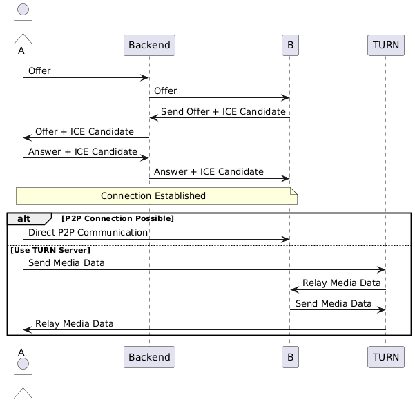

 <h1>Video Calling App</h1>
    
This project is a full-stack video calling application. The backend is built using <strong>Spring Boot</strong>, <strong>WebRTC</strong>, <strong>WebSockets</strong>, and the frontend uses <strong>HTML</strong>, <strong>CSS</strong>, <strong>JavaScript</strong>, along with <strong>STOMP Client</strong> and <strong>SockJS</strong> for WebSocket communication.

<h2>Features</h2>
<ul>
<li>Real-time video and audio communication.</li>
        <li>User signaling using WebSockets.</li>
        <li>Interactive and responsive UI.</li>
        <li>Easy integration with WebRTC for peer-to-peer communication.</li>
        <li>STOMP protocol for WebSocket communication.</li>
    </ul>

<h2>Technologies Used</h2>

<h3>Backend:</h3>
<ul>
        <li><strong>Spring Boot</strong>: REST API and WebSocket server.</li>
        <li><strong>WebRTC</strong>: Peer-to-peer video calling.</li>
        <li><strong>WebSockets</strong>: Signaling mechanism.</li>
</ul>

<h3>Frontend:</h3>
    <ul>
        <li><strong>HTML, CSS, JavaScript</strong>: User interface.</li>
        <li><strong>STOMP Client</strong>: Communication protocol over WebSockets.</li>
        <li><strong>SockJS</strong>: Fallback support for WebSocket communication.</li>
    </ul>

<h2>System Design</h2>
    
The application uses WebRTC for establishing peer-to-peer communication. A Spring Boot server acts as the signaling server to exchange metadata between peers (SDP and ICE candidates) using WebSockets.

<h3>Diagram</h3>
    
Below is the system design diagram illustrating the flow of the application:

    

<h2>Project Setup</h2>

<h3>Backend Setup</h3>
    <ol>
        <li>Clone the repository:
            <pre><code>git clone &lt;repository-url&gt;</code></pre>
        </li>
        <li>Navigate to the backend directory:
            <pre><code>cd backend</code></pre>
        </li>
        <li>Build and run the Spring Boot application:
            <pre><code>./mvnw spring-boot:run</code></pre>
        </li>
<li>Now open "https://localhost:3000" to access the frontend.
</li>
    </ol>

<h2>How It Works</h2>
    <ol>
        <li><strong>Signaling:</strong>
            <ul>
                <li>The client connects to the Spring Boot WebSocket server.</li>
                <li>Users exchange SDP (Session Description Protocol) and ICE (Interactive Connectivity Establishment) candidates through WebSockets.</li>
            </ul>
        </li>
        <li><strong>WebRTC Peer Connection:</strong>
            <ul>
                <li>WebRTC APIs establish a peer-to-peer connection between users for audio and video streaming.</li>
            </ul>
        </li>
        <li><strong>Media Stream:</strong>
            <ul>
                <li>Local media streams are captured using WebRTC and shared over the peer connection.</li>
            </ul>
        </li>
    </ol>

<h2>Contributing</h2>
    
Contributions are welcome! Please fork the repository and create a pull request with your changes.

